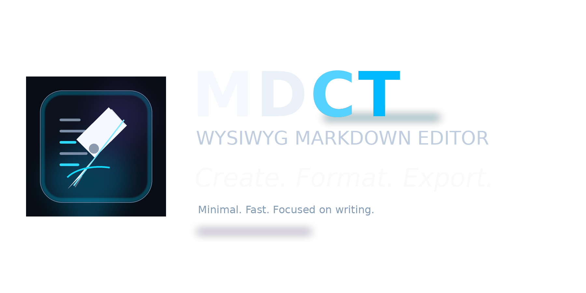

# MDCT.NET Samples

This document demonstrates the Markdown features and editor workflows supported by `MDCT.NET`.

Open this file from the repository root so the relative image paths resolve correctly in `MarkdownPad`.

Quick links:

- [Open the project overview](README.md)
- [Jump to Headings](#headings)
- [Jump to Quotes and Admonitions](#quotes-and-admonitions)
- [Jump to Lists and Tasks](#lists-and-tasks)
- [Jump to Inline Features](#inline-features)
- [Jump to Tables](#tables)
- [Jump to Images](#images)
- [Jump to Footnotes](#footnotes)
- [Jump to Editor Workflows](#editor-workflows)

---

## Headings

This section shows all heading levels.

# Heading 1
## Heading 2
### Heading 3
#### Heading 4
##### Heading 5
###### Heading 6

---

## Paragraphs and Basic Text Flow

MDCT.NET is designed to render Markdown as a readable document while keeping the Markdown source editable.

This paragraph is plain text.

This paragraph contains multiple sentences so line wrapping and paragraph spacing can be observed in the control. The text is intentionally a bit longer to make wrapping behavior visible in both the control and `MarkdownPad`.

---

## Quotes and Admonitions

Regular quote:

> This is a standard block quote.
> It spans multiple visual lines.

`NOTE` admonition:

> [!NOTE]
> Use admonitions when you want a semantic callout instead of a plain quote.

`TIP` admonition:

> [!TIP]
> `MarkdownPad` is a good place to try theme switching, scaling, and raw/presentation workflows.

`IMPORTANT` admonition:

> [!IMPORTANT]
> The underlying Markdown source remains the real document state.

`WARNING` admonition:

> [!WARNING]
> Complex formatting, links, images, and visual editing still map back to source positions.

`CAUTION` admonition:

> [!CAUTION]
> If you move this file out of the repository root, the sample image paths in this document will no longer be relative to the correct folder.

---

## Lists and Tasks

Unordered list:

- First item
- Second item
- Third item

Ordered list:

1. First step
2. Second step
3. Third step

Nested list:

- Parent item
  - Child item A
  - Child item B
    - Grandchild item
- Another parent item

Task list:

- [ ] Unchecked task
- [x] Checked task
- [ ] Another open task

Nested task list:

- [x] Prepare project structure
  - [x] Add control library
  - [x] Add sample editor
  - [ ] Add more demos
- [ ] Final polish

---

## Inline Features

### Emphasis

This line shows *italic*, **bold**, ***bold italic***, ~~strike-through~~, and `inline code`.

Escaped characters stay literal: \*not italic\*, \[not a link\], and \!\[not an image\].

### Links

External link: [Open OpenAI](https://openai.com)

Local file link: [Open README](README.md)

Internal anchor link: [Jump to Tables](#tables)

Bare URL detection: https://example.com/docs/markdown?mode=demo

### Color Wrappers

Foreground color:


Background color:


Combined nesting:

)

Another nested example:

)

### Mixed Inline Content

This sentence mixes **bold**, [a link](https://example.com), `code`, , and a footnote reference[^mixed].

---

## Horizontal Rules

The parser supports horizontal rules such as `---`, `***`, and `___`.

---

Above was `---`.

***

Above was `***`.

___

Above was `___`.

---

## Code Fences

Fenced code block with language hint:

```csharp
using MarkdownGdi;

var editor = new MarkdownGdiEditor
{
    Dock = DockStyle.Fill,
    ThemeMode = EditorThemeMode.System
};

editor.LoadDocument("# Hello from MDCT.NET", null, resetUndoStacks: true);
```

Another fenced block:

```md
# Markdown

- [x] Rendered as a document
- [x] Still editable as source
- [x] Supports tables, links, images, and footnotes
```

---

## Tables

This table demonstrates header rows, alignment, inline formatting, and color wrappers inside cells.

| Feature | Alignment | Example |
| :--- | :---: | ---: |
| Bold | Center | **Strong** |
| Inline code | Center | `code` |
| Link | Center | [README](README.md) |
| Foreground color | Center |  |
| Background color | Center |  |
| Strike-through | Center | ~~Old~~ |

Another table for visual grid editing:

| Name | State | Notes |
| :--- | :---: | ---: |
| Parser | Done | Stable |
| Layout | Done | Source-aware |
| Tables | Done | Visual editing |
| Samples | WIP | Add more cases |

---

## Images

Inline image inside a paragraph:

The MDCT.NET logo can also appear inline:  inside flowing text.

Standalone image block:



Another standalone image block:


---

## Footnotes

Footnote references can be used inline like this[^engine] and repeated like this[^engine].

Another footnote reference appears here[^editor].

[^engine]: `MarkdownControlNET` is the reusable WinForms control library that handles parsing, layout, rendering, editing, mapping, and interaction.

[^editor]: `MarkdownPad` is the sample application built on top of the control. It demonstrates tabs, dialogs, theming, printing, link handling, scaling, color commands, and session restore.

[^mixed]: Mixed inline content is useful for checking that the visual layout still maps correctly to the source.

---

## Combined Feature Demo

> [!TIP]
> The next block intentionally mixes several features together.

1. A list can contain [links](README.md), `code`, and footnotes[^combo].
2. It can also contain  and nested formatting like **bold with `code` inside**.
3. Tables, images, and quotes can coexist in the same document without switching to a separate preview.

| Block | Example |
| :--- | :--- |
| Quote | > visible as a quote |
| Code | `inline code` |
| Color |  |
| Link | [Jump to Images](#images) |

[^combo]: This is a combined-feature footnote.

---

## Editor Workflows

The items below are not just syntax samples. They are things you should actively try in `MarkdownPad`.

### Table Workflows

- Click into a rendered table cell to edit it visually.
- Move between cells and confirm that the Markdown table source updates.
- Try switching between visual table editing and raw table source editing.

### Link Workflows

- Click [README.md](README.md) to open another Markdown document.
- Click [Jump to Footnotes](#footnotes) to test in-document anchor navigation.
- Click a web link such as [Open OpenAI](https://openai.com) to test external link activation.

### Color Workflows

- Select any text in this document.
- Use the `FG` toolbar button or `Foreground Color...` from the menu or context menu.
- Use the `BG` toolbar button or `Background Color...` from the menu or context menu.
- Inspect the inserted Markdown syntax in the source.

### Search and Navigation

- Use `Find` and `Find Next`.
- Navigate between repeated words such as `Markdown`, `table`, or `color`.
- Jump to headings through internal links.

### View and Presentation

- Change the theme between system, light, and dark mode.
- Adjust the view scale with the toolbar slider.
- Use print preview to verify page-style rendering.

### Raw vs Presentation Editing

- Place the caret in complex regions such as tables or fenced code blocks.
- Observe how the editor balances visual presentation with exact source editing where needed.

---

## End of Samples

If this document renders correctly, you have a compact demonstration of the current MDCT.NET feature set in a single file.
